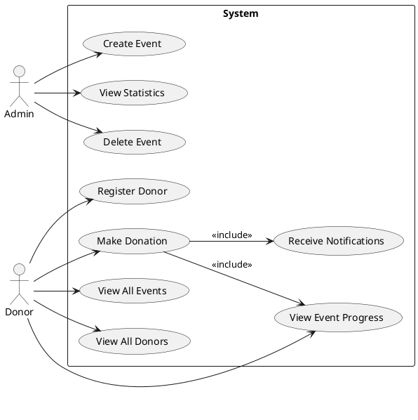
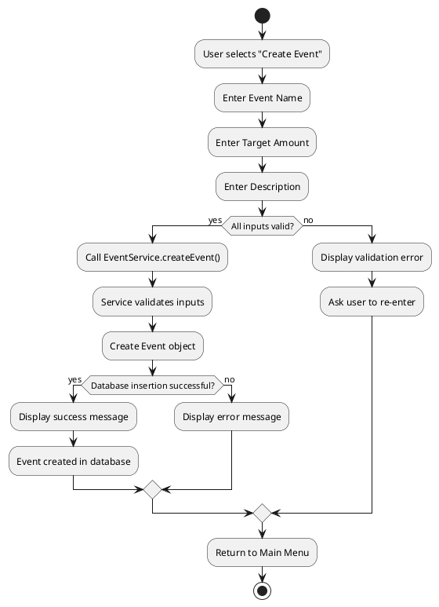
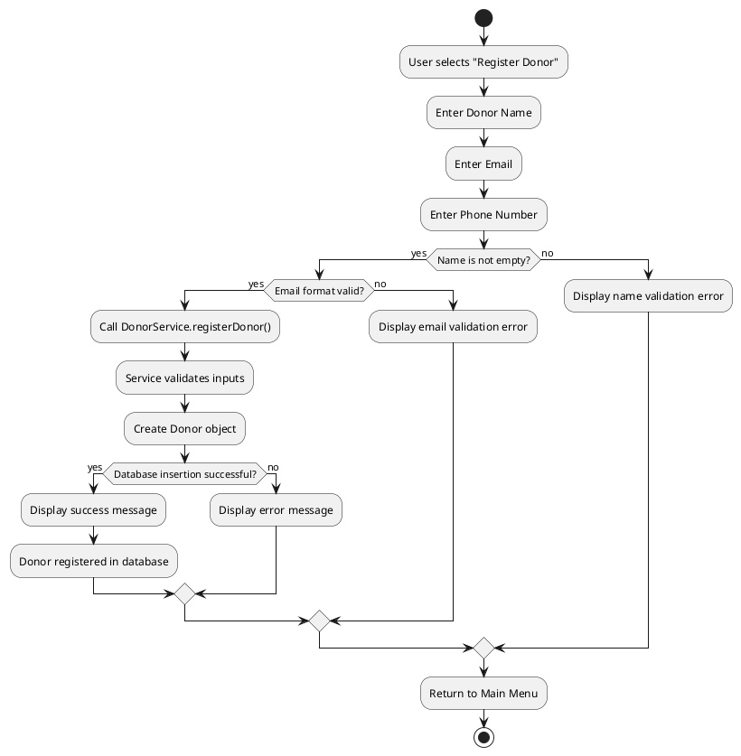
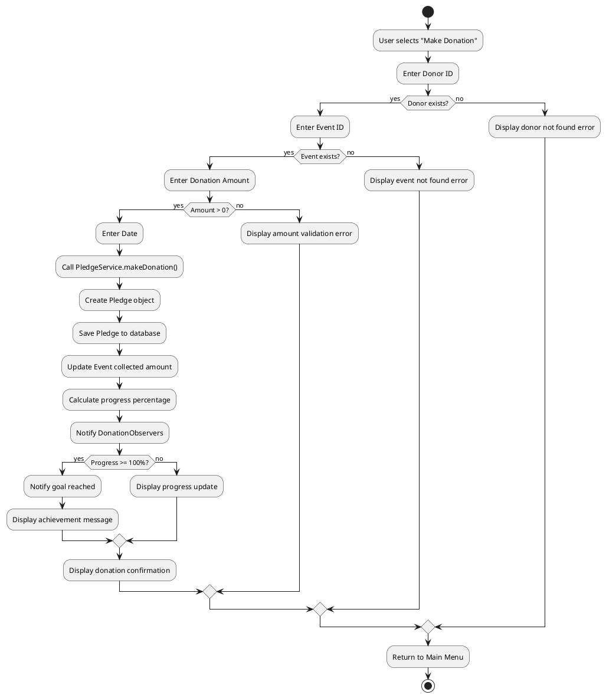
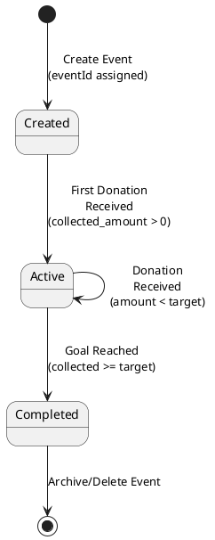
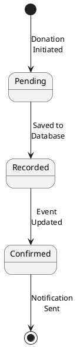
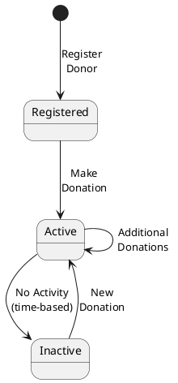
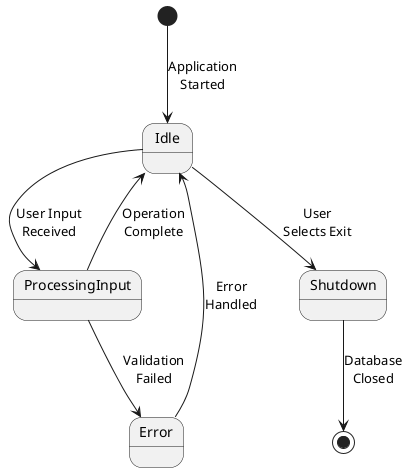

# 📊 UML Diagrams - Charity Event Fundraising Tracker

## 1. USE CASE DIAGRAM



**Explanation:**
- **Admin Actor:** Creates events, manages system, deletes outdated events, views statistics
- **Donor Actor:** Registers, makes donations, views event progress and other donors
- **Use Cases:** 9 main operations supported by the system
- **Include Relationship:** Donation (UC3) includes progress update (UC4) and notification (UC9)

---

## 2. CLASS DIAGRAM

```plantuml
@startuml Class_Diagram

' Model Classes
class Event {
  - eventId: int
  - eventName: String
  - targetAmount: double
  - collectedAmount: double
  - description: String
  ---
  + getEventId(): int
  + getEventName(): String
  + getProgressPercentage(): double
  + getCollectedAmount(): double
}

class Donor {
  - donorId: int
  - donorName: String
  - email: String
  - phoneNumber: String
  ---
  + getDonorId(): int
  + getDonorName(): String
  + getEmail(): String
}

class Pledge {
  - pledgeId: int
  - donorId: int
  - eventId: int
  - pledgeAmount: double
  - pledgeDate: String
  ---
  + getPledgeId(): int
  + getPledgeAmount(): double
  + getDonorId(): int
}

' DAO Classes
class EventDAO {
  - eventDAO: EventDAO
  ---
  + addEvent(event): boolean
  + getEventById(id): Event
  + getAllEvents(): List<Event>
  + updateCollectedAmount(id, amount): boolean
  + deleteEvent(id): boolean
}

class DonorDAO {
  - donorDAO: DonorDAO
  ---
  + addDonor(donor): boolean
  + getDonorById(id): Donor
  + getAllDonors(): List<Donor>
  + getDonorByName(name): Donor
}

class PledgeDAO {
  - pledgeDAO: PledgeDAO
  ---
  + addPledge(pledge): boolean
  + getPledgeById(id): Pledge
  + getPledgesByEvent(eventId): List<Pledge>
  + getPledgesByDonor(donorId): List<Pledge>
  + getTotalPledgedForEvent(eventId): double
}

' Database Connection
class DBConnection {
  - {static} connection: Connection
  - {static} instance: DBConnection
  ---
  - {static} DBConnection()
  + {static} getConnection(): Connection
  + {static} closeConnection(): void
  + {static} initializeDatabase(): void
}

' Service Layer
class EventService {
  - eventDAO: EventDAO
  ---
  + createEvent(name, target, desc): boolean
  + getEvent(id): Event
  + getAllEvents(): List<Event>
  + updateCollectedAmount(id, amount): boolean
}

class DonorService {
  - donorDAO: DonorDAO
  ---
  + registerDonor(name, email, phone): boolean
  + getDonor(id): Donor
  + getAllDonors(): List<Donor>
  + findDonorByName(name): Donor
}

class PledgeService {
  - pledgeDAO: PledgeDAO
  - eventDAO: EventDAO
  - eventManager: DonationEventManager
  ---
  + makeDonation(donorId, eventId, amount, date): boolean
  + getPledgesForEvent(eventId): List<Pledge>
  + getTotalPledgedForEvent(eventId): double
}

class ServiceFactory {
  - {static} eventService: EventService
  - {static} donorService: DonorService
  - {static} pledgeService: PledgeService
  ---
  - ServiceFactory()
  + {static} getEventService(): EventService
  + {static} getDonorService(): DonorService
  + {static} getPledgeService(): PledgeService
}

' Observer Pattern
interface DonationObserver {
  + onDonationReceived(pledge, event): void
  + onGoalReached(event): void
  + onProgressUpdated(event, percentage): void
}

class EventProgressTracker {
  - name: String
  ---
  + onDonationReceived(pledge, event): void
  + onGoalReached(event): void
  + onProgressUpdated(event, percentage): void
}

class DonationEventManager {
  - {static} instance: DonationEventManager
  - observers: List<DonationObserver>
  ---
  + {static} getInstance(): DonationEventManager
  + subscribe(observer): void
  + unsubscribe(observer): void
  + notifyDonationReceived(pledge, event): void
  + notifyGoalReached(event): void
}

' MVC Components
class ConsoleView {
  - scanner: Scanner
  ---
  + displayMainMenu(): void
  + displayAllEvents(events): void
  + displayAllDonors(donors): void
  + inputEventName(): String
  + inputDonationAmount(): double
}

class CharityTrackerController {
  - eventService: EventService
  - donorService: DonorService
  - pledgeService: PledgeService
  - view: ConsoleView
  - eventManager: DonationEventManager
  ---
  + run(): void
  - handleCreateEvent(): void
  - handleRegisterDonor(): void
  - handleMakeDonation(): void
  - handleViewAllEvents(): void
}

' Relationships
EventDAO --> DBConnection
DonorDAO --> DBConnection
PledgeDAO --> DBConnection

EventService --> EventDAO
DonorService --> DonorDAO
PledgeService --> PledgeDAO
PledgeService --> EventDAO
PledgeService --> DonationEventManager

EventService --> Event
DonorService --> Donor
PledgeService --> Pledge

EventProgressTracker --|> DonationObserver
DonationEventManager --> DonationObserver

CharityTrackerController --> EventService
CharityTrackerController --> DonorService
CharityTrackerController --> PledgeService
CharityTrackerController --> ConsoleView
CharityTrackerController --> DonationEventManager

@enduml
```



**Explanation:**
- **Model Layer:** Event, Donor, Pledge (POJO classes)
- **DAO Layer:** EventDAO, DonorDAO, PledgeDAO (database operations)
- **Service Layer:** EventService, DonorService, PledgeService (business logic with Facade pattern)
- **Controller:** CharityTrackerController (orchestrates MVC)
- **View:** ConsoleView (user interface)
- **Observer:** DonationEventManager + DonationObserver (observer pattern)
- **Relationships:** Show dependencies and message flow

---

## 3. ACTIVITY DIAGRAMS

### 3.1 Create Event Activity Diagram



### 3.2 Register Donor Activity Diagram



### 3.3 Make Donation Activity Diagram



### 3.4 View Event Progress Activity Diagram

```plantuml
@startuml ViewEventProgress_Activity

start
:User selects "View Event Progress";
:Enter Event ID;
if (Event exists?) then (yes)
  :Retrieve Event from database;
  :Get all pledges for event;
  if (Pledges exist?) then (yes)
    :Calculate total collected;
    :Calculate progress percentage;
    :Generate progress bar;
    :Display event details;
    :Display progress visualization;
    :For each pledge:
      :Display donor name;
      :Display donation amount;
      :Display donation date;
    endfor
    :Display total contributors;
  else (no)
    :Display "no donations yet" message;
  endif
else (no)
  :Display event not found error;
endif
:Return to Main Menu;
stop

@enduml
```

---

## 4. STATE DIAGRAMS

### 4.1 Event State Diagram



### 4.2 Donation (Pledge) State Diagram



### 4.3 Donor State Diagram



### 4.4 System State Diagram



---

## Summary

- **Use Case Diagram:** Shows actors and their interactions with the system
- **Class Diagram:** Shows all classes, attributes, methods, and relationships
- **Activity Diagrams:** Show step-by-step flows for key operations
- **State Diagrams:** Show state transitions for events, donations, donors, and system

All diagrams follow UML standards and are rendered in PlantUML format.
